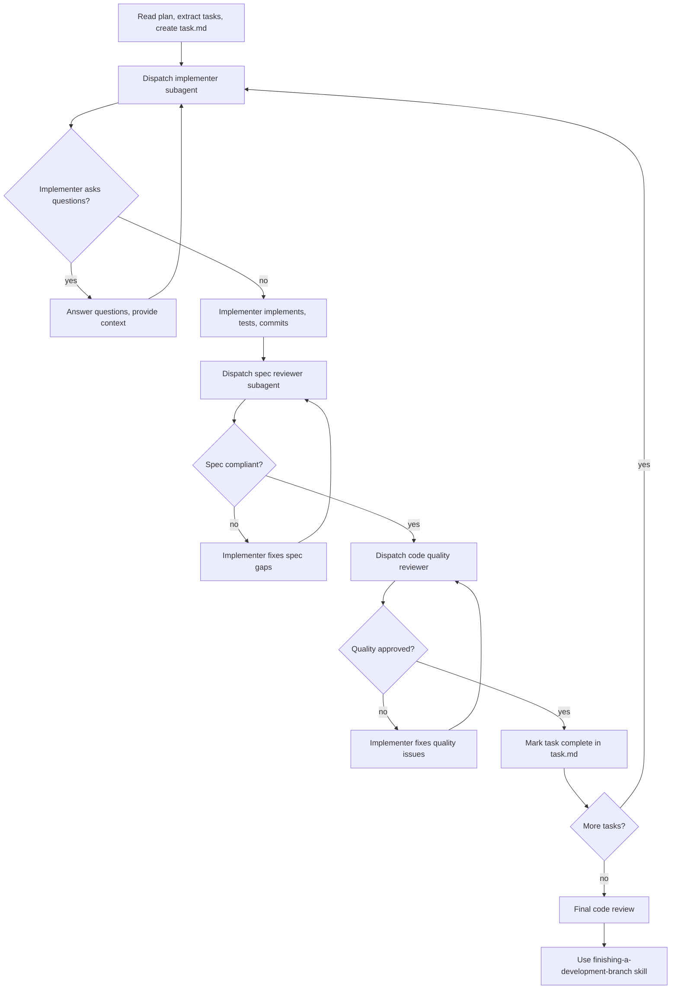

# Subagent-Driven Development

Execute plan by dispatching fresh subagent per task, with two-stage review after each: spec compliance review first, then code quality review.

**Core principle:** Fresh subagent per task + two-stage review (spec then quality) = high quality, fast iteration

## When to Use

**Use when:**
- You have an implementation plan
- Tasks are mostly independent
- You want to stay in the current session

**vs. Executing Plans:**
- Same session (no context switch)
- Fresh subagent per task (no context pollution)
- Two-stage review after each task
- Faster iteration

## The Process



## Prompt Templates

See the following files in this skill directory:
- `implementer-prompt.md` - Dispatch implementer subagent
- `spec-reviewer-prompt.md` - Dispatch spec compliance reviewer subagent
- `code-quality-reviewer-prompt.md` - Dispatch code quality reviewer subagent

## Example Workflow

```
You: I'm using Subagent-Driven Development to execute this plan.

[Read plan file: docs/plans/feature-plan.md]
[Extract all 5 tasks with full text and context]
[Create task.md with all tasks]

Task 1: Hook installation script

[Dispatch implementation subagent with full task text + context]

Implementer: "Before I begin - should the hook be installed at user or system level?"
You: "User level (~/.config/superpowers/hooks/)"

Implementer: "Got it. Implementing now..."
[Later] Implementer:
  - Implemented install-hook command
  - Added tests, 5/5 passing
  - Self-review: Found I missed --force flag, added it
  - Committed

[Dispatch spec compliance reviewer]
Spec reviewer: ✅ Spec compliant - all requirements met

[Dispatch code quality reviewer]
Code reviewer: Strengths: Good test coverage. Issues: None. Approved.

[Mark Task 1 complete]
...continue with remaining tasks...
```

## Advantages

**vs. Manual execution:**
- Subagents follow TDD naturally
- Fresh context per task (no confusion)
- Subagent can ask questions

**Quality gates:**
- Self-review catches issues before handoff
- Two-stage review: spec compliance, then code quality
- Review loops ensure fixes actually work

## Red Flags

**Never:**
- Start implementation on main/master branch without explicit user consent
- Skip reviews (spec compliance OR code quality)
- Proceed with unfixed issues
- Dispatch multiple implementation subagents in parallel (conflicts)
- Make subagent read plan file (provide full text instead)
- **Start code quality review before spec compliance is ✅**
- Move to next task while either review has open issues

**If subagent asks questions:**
- Answer clearly and completely
- Don't rush them into implementation

**If reviewer finds issues:**
- Implementer fixes them
- Reviewer reviews again
- Repeat until approved

## Integration

**Related skills:**
- **`superpowers-using-git-worktrees`** - Set up isolated workspace before starting
- **`superpowers-writing-plans`** - Creates the plan this skill executes
- **`superpowers-requesting-code-review`** - Code review template for reviewer subagents
- **`superpowers-finishing-a-development-branch`** - Complete development after all tasks
- **`superpowers-test-driven-development`** - Subagents follow TDD for each task

**Alternative workflow:**
- **`superpowers-executing-plans`** - Use for batch execution with checkpoints
